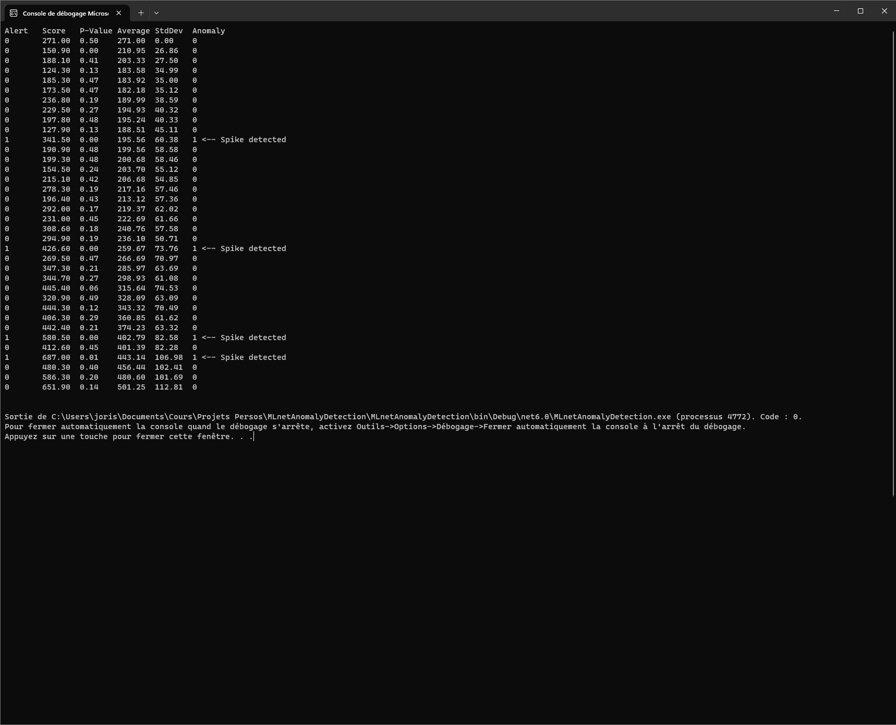

# MLnetAnomalyDetection

## The project

The purpose of this project is to discover the ML.NET nugget for anomaly detection with this tutorial https://learn.microsoft.com/fr-fr/dotnet/machine-learning/tutorials/sales-anomaly-detection

There are Dates, Sales, and a column Alert to show if the sales figures are an anomaly or not, 

I added columns Average, Standard Deviation and Anomaly to show the sales figures outside the range average more or less 2 standards deviations

